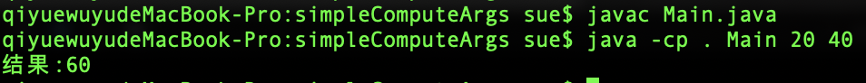

# pointoj-code-sandbox 代码沙箱📦


## JAVA 原生实现代码沙箱
java 程序执行流程
接收代码 =>编译代码（javaC） => 执行代码（java）

### 测试


OJ程序中对用户的输入是有一定要求的，便于系统进行统一的处理和判题。
将用户输入的代码类名限制为Main，减少编译时类名不一致的风险，方便。

文件名 Main.java 示例代码

````java
public class Main {
    public static void main(String[] args) {
        int a = Integer.parseInt(args[0]);
        int b = Integer.parseInt(args[1]);
        System.out.println("结果:" + (a + b));
    }
}
````




## 实现思路

核心：程序代替人工
- 将用户的代码保存为文件
- 编译代码，得到class文件
- 执行代码，得到输出结果
- 收集整理输出结果
- 文件清理，释放空间
- 错误处理，提升程序健壮性
